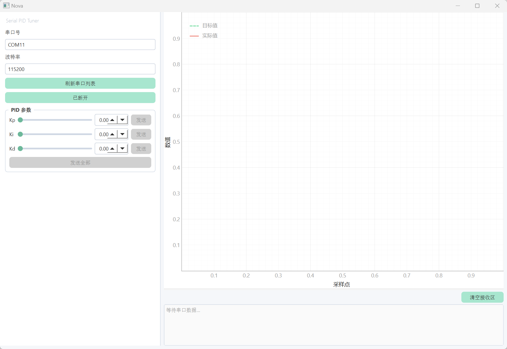

# 🎛️ Nova — PID 调试助手

> 一个基于 **PySide6 + pyqtgraph + pyserial** 的跨平台 PID 调参上位机。  
> 协议简洁，嵌入式端一行 `printf` 即可对接，开箱即用。


---

## 📸 界面截图

> 🖼️ 

---

## ✨ 功能特性

| 功能 | 说明 |
|------|------|
| 📡 串口接收 | 自动扫描串口，支持常用波特率，后台线程无阻塞读取 |
| 📈 实时波形 | 目标值 / 实际值双曲线，500 点环形缓冲，支持鼠标缩放拖拽 |
| 🎚️ PID 调参 | Kp / Ki / Kd 滑块 + 数值框双向联动，单参数或一键全部下发 |
| 🖥️ 现代 UI | 清新薄荷绿风格，圆角控件，左右分栏布局 |
| 🧹 清空接收区 | 一键清空文本框，波形不受影响 |
| 📦 单文件打包 | 支持 PyInstaller 打包为独立 exe（Windows） |

---

## 🔌 通信协议

### 下位机 → 上位机（数据帧）

```
>ID,目标值,实际值,输出值\r\n
```

| 字段 | 类型 | 示例 | 说明 |
|------|------|------|------|
| ID | int | `1` | 回路编号（当前支持 ID=1） |
| 目标值 | float | `1500.50` | Setpoint |
| 实际值 | float | `1498.30` | Process Variable |
| 输出值 | float | `0.65` | Controller Output |

**示例帧：**
```
>1,1500.50,1498.30,0.65\r\n
```

嵌入式端对接示例（C语言）：
```c
printf(">1,%.2f,%.2f,%.2f\r\n", setpoint, actual, output);
```

### 上位机 → 下位机（PID 下发）

```
PID:Kp,Ki,Kd\r\n
```

**示例：**
```
PID:1.20,0.05,0.10\r\n
```

---

## 🚀 安装与运行

### 环境要求

- Python 3.11+
- Windows / macOS / Linux

### 克隆仓库

```bash
git clone https://github.com/your-username/pid-tuner.git
cd pid-tuner
```

### 创建虚拟环境

```bash
python -m venv venv
```

激活虚拟环境：

```bash
# Windows (PowerShell)
venv\Scripts\Activate.ps1

# Windows (CMD)
venv\Scripts\activate.bat

# macOS / Linux
source venv/bin/activate
```

### 安装依赖

```bash
pip install -r requirements.txt
```

### 运行

```bash
python main.py
```

---

## 🧪 虚拟串口测试

没有硬件？用虚拟串口模拟数据：

**Windows** — 安装 [com0com](https://sourceforge.net/projects/com0com/)，创建虚拟串口对：
```
install PortName=COM20 PortName=COM21
```

**macOS / Linux** — 使用 socat：
```bash
socat -d -d pty,raw,echo=0,link=/tmp/ttyV0 pty,raw,echo=0,link=/tmp/ttyV1
```

启动虚拟发送器（终端1）：
```bash
python virtual_serial_sender.py COM20   # Windows
python virtual_serial_sender.py /tmp/ttyV0  # macOS/Linux
```

启动上位机（终端2），选择对端串口（COM21 或 /tmp/ttyV1），点击"已断开"连接即可。

---

## 📦 打包为 exe（Windows）

```bash
pip install pyinstaller
pyinstaller --onefile --windowed --name "PID-Tuner" main.py
```

生成文件位于 `dist/PID-Tuner.exe`，可直接分发，无需安装 Python。

---

## 🤝 贡献指南

欢迎提交 Issue 和 Pull Request！

1. Fork 本仓库
2. 创建特性分支：`git checkout -b feature/your-feature`
3. 提交更改：`git commit -m 'feat: add your feature'`
4. 推送分支：`git push origin feature/your-feature`
5. 发起 Pull Request

---

## 📄 许可证

本项目基于 [MIT License](LICENSE) 开源。

```
MIT License

Copyright (c) 2026 your-name

Permission is hereby granted, free of charge, to any person obtaining a copy
of this software and associated documentation files (the "Software"), to deal
in the Software without restriction, including without limitation the rights
to use, copy, modify, merge, publish, distribute, sublicense, and/or sell
copies of the Software, and to permit persons to whom the Software is
furnished to do so, subject to the following conditions:

The above copyright notice and this permission notice shall be included in all
copies or substantial portions of the Software.

THE SOFTWARE IS PROVIDED "AS IS", WITHOUT WARRANTY OF ANY KIND, EXPRESS OR
IMPLIED, INCLUDING BUT NOT LIMITED TO THE WARRANTIES OF MERCHANTABILITY,
FITNESS FOR A PARTICULAR PURPOSE AND NONINFRINGEMENT. IN NO EVENT SHALL THE
AUTHORS OR COPYRIGHT HOLDERS BE LIABLE FOR ANY CLAIM, DAMAGES OR OTHER
LIABILITY, WHETHER IN AN ACTION OF CONTRACT, TORT OR OTHERWISE, ARISING FROM,
OUT OF OR IN CONNECTION WITH THE SOFTWARE OR THE USE OR OTHER DEALINGS IN THE
SOFTWARE.
```

---

## 🙏 致谢

- [PySide6](https://doc.qt.io/qtforpython/) — Qt for Python，跨平台 GUI 框架
- [pyqtgraph](https://www.pyqtgraph.org/) — 高性能科学绘图库
- [pyserial](https://pyserial.readthedocs.io/) — Python 串口通信库

---

## 📬 联系方式

> 💬 *欢迎通过 GitHub Issues 反馈问题或建议。*
