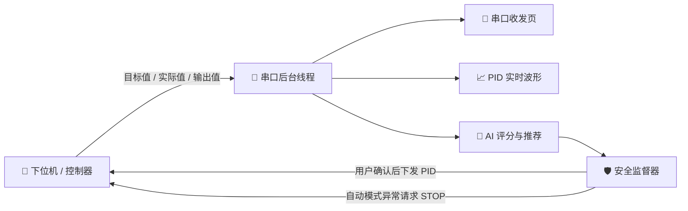

<div align="center">

# ⚡ Nova

### 🎛️ 下一代串口调试 · PID 可视化 · AI 辅助调参上位机

**让串口通信更直观，让 PID 调参更聪明。**

<p>
  
  
  
  
</p>

<p>
  <a href="#-界面预览">界面预览</a> •
  <a href="#-核心能力">核心能力</a> •
  <a href="#-快速开始">快速开始</a> •
  <a href="#-通信协议">通信协议</a> •
  <a href="#-ai-辅助-pid-调参">AI 调参</a>
</p>

</div>

---

## 🌌 项目简介

**Nova** 是一款基于 **PySide6、pyqtgraph、pyserial 与 NumPy** 构建的跨平台串口 PID 调试上位机。

它将常用串口工具、实时 PID 波形、六位小数精度调参和本地 AI 优化整合在同一个现代化桌面界面中。无论是电机、温控、位置环还是其他闭环控制系统，都可以通过一条简单的数据帧快速接入。

> 🔒 PID 优化与自动试验完全在本地运行。可选“云端解释”仅在用户确认后上传指标摘要，不控制设备；无需云端服务也能完成调参。

---

## 🖼️ 界面预览

### 🔌 01 · 串口收发

端口扫描、串口参数配置、字符串/十六进制收发、循环发送和实时 RX/TX 统计一站完成。

<div align="center">
  
</div>

### 📈 02 · 手动 PID 调参

Kp、Ki、Kd 数值框与滑块双向联动，小数精度可在 **2～6 位**之间独立调节，并实时绘制目标值与实际值曲线。

<div align="center">
  
</div>

### ✨ 03 · AI 辅助调参

以稳定 PID 为起点，自动分析阶跃响应、计算性能评分，并在安全边界内生成下一组 PID 推荐值。

<div align="center">
  
</div>

---

## 🚀 核心能力

| 模块 | 能力 | 说明 |
|:---:|---|---|
| 🔌 | **串口管理** | 自动扫描端口，支持常用波特率、数据位、校验位与停止位配置 |
| 💬 | **双模式收发** | 字符串 / 十六进制发送与接收，支持循环定时发送 |
| 🧵 | **后台读取** | 独立线程读取串口，批量刷新 UI，降低高速数据导致的界面卡顿 |
| 📊 | **实时波形** | 目标值 / 实际值双曲线，500 点环形缓冲，支持缩放、拖拽和自动范围 |
| 🎚️ | **高精度 PID** | Kp / Ki / Kd 支持 2～6 位小数，滑块、输入框和发送精度实时同步 |
| 📤 | **灵活下发** | 支持单独发送 Kp、Ki、Kd，也支持一键发送全部参数 |
| 🧠 | **本地 AI 优化** | 轻量高斯过程贝叶斯优化，根据历史试验逐轮推荐更优参数 |
| 🛡️ | **安全约束** | 参数范围、单次变化比例、实际值、输出值和超调量多重保护 |
| ↩️ | **确认与停止** | 自动模式逐条确认设备执行；异常请求停止，最终复测后由用户接受或恢复原参数 |
| 🌐 | **中英双语** | 中文 / English 一键切换并自动记忆语言设置 |
| 💾 | **会话记录** | 自动保存 AI 调参配置、每轮指标、PID 参数和采样数据 |

---

## 🧭 数据流



---

## ⚡ 快速开始

### 1️⃣ 环境要求

- Python **3.11+**
- Windows / Linux / macOS
- 一组物理串口或虚拟串口对

### 2️⃣ 克隆项目

```bash
git clone https://github.com/zwj051029/Nova.git
cd Nova
```

### 3️⃣ 创建虚拟环境

```bash
python -m venv venv
```

<details>
<summary>👉 点击查看各平台激活命令</summary>

```powershell
# Windows PowerShell
.\venv\Scripts\Activate.ps1
```

```bat
:: Windows CMD
venv\Scripts\activate.bat
```

```bash
# Linux / macOS
source venv/bin/activate
```

</details>

### 4️⃣ 安装依赖

```bash
pip install -r requirements.txt
```

### 5️⃣ 启动 Nova

```bash
python main.py
```

如果直接使用仓库内已有的 Windows 虚拟环境，也可以运行：

```powershell
.\venv\Scripts\python.exe .\main.py
```

---

## 🔗 通信协议

Nova 默认使用 **UTF-8 文本协议 + `\r\n` 行结束符**，便于 MCU 使用 `printf` 快速对接。

### 📥 下位机 → 上位机：实时数据帧

```text
>ID,Setpoint,Actual,Output\r\n
```

示例：

```text
>1,1500.500000,1498.300000,0.650000\r\n
```

| 字段 | 类型 | 含义 |
|---|---|---|
| `ID` | `int` | 控制回路编号 |
| `Setpoint` | `float` | 目标值 |
| `Actual` | `float` | 实际值 / 过程值 |
| `Output` | `float` | 控制器输出 |

嵌入式 C 示例：

```c
printf(">1,%.6f,%.6f,%.6f\r\n", setpoint, actual, output);
```

### 📤 上位机 → 下位机：发送全部 PID

```text
PID:Kp,Ki,Kd\r\n
```

示例：

```text
PID:1.250000,0.050000,0.001000\r\n
```

### 🎯 上位机 → 下位机：发送单个参数

```text
PID:Kp=1.250000\r\n
PID:Ki=0.050000\r\n
PID:Kd=0.001000\r\n
```

> 💡 下位机需要同时兼容“全部发送”和“单参数发送”两种格式，才能使用手动调参页的所有按钮。

---

## 🧠 AI 辅助 PID 调参

Nova 的 AI 调参不是让大语言模型“猜参数”，而是使用更适合控制器实验的 **高斯过程贝叶斯优化**：根据已完成试验的 PID 与评分建立概率模型，再选择兼顾性能提升和探索价值的下一组参数。

### 🔄 标准工作流

1. 🔌 打开串口，确认实时数据帧与波形正常。
2. ✅ 准备一组已经确认稳定的 Kp、Ki、Kd。
3. ✨ 进入“AI 调参”，点击“读取手动调参页数值”或手动填写基准 PID。
4. ⏱️ 填写下位机真实采样周期和单次采集时间。
5. 🛡️ 设置参数最大值、单次最大变化、实际值范围、输出上限和最大超调。
6. ▶️ 点击“开始基准采集”，随后手动改变一次目标值并保持不变。
7. 📊 等待自动结束或点击“结束并评分”。
8. 🧠 点击“生成 AI 推荐”，审核参数与推荐依据。
9. 🚀 点击“应用推荐并采集”，重复同样的阶跃试验。
10. 🏆 多轮迭代后，对比“基准 PID”“AI 推荐 PID”和“当前最佳 PID / 评分”。

### 📐 自动计算指标

| 指标 | 用途 |
|---|---|
| ⏫ 上升时间 | 衡量系统响应速度 |
| 🎯 调节时间 | 衡量系统进入并保持在误差带内的速度 |
| 🌊 超调量 | 衡量目标值越界程度 |
| 📍 稳态误差 | 衡量最终跟踪精度 |
| ∫ IAE / ITAE | 衡量全过程误差与时间加权误差 |
| ⚙️ 输出变化 | 抑制控制输出过度抖动 |
| 💯 综合评分 | 统一比较不同 PID 的整体表现，分数越低越好 |

### 🛡️ 安全机制

- 候选 PID 必须位于用户设置的绝对范围内。
- 搜索候选变化受“相对比例或零附近绝对步长”约束，Kp/Ki/Kd 可独立配置。
- 实际值或输出值越界时立即中止采集。
- 实时超调超过阈值时停止当前试验。
- 无阶跃、采样不足、目标值未保持稳定的数据不会进入 AI 学习。
- 旧协议人工采集模式异常时尝试恢复基准，但无法确认设备生效。
- Nova v2 自动模式异常时请求停止输出；通信中断时依靠下位机独立看门狗。
- 支持逐轮人工确认与用户明确启用的受限自动模式。

> [!CAUTION]
> 上位机安全检查不能替代下位机保护。真实设备必须在固件中实现输出限幅、积分抗饱和、超温/超速保护和通信看门狗。首次试验请使用保守参数与较小阶跃。

### 🤖 自动闭环模式（Nova v2）

自动流程：**能力检查 → 读取原参数 → 配置硬件保护 → 停止 → 参数确认 → 初始稳定 → 阶跃前采集 → 阶跃确认 → 评分 → 下一轮 → 最优复测 → 停止 → 人工接受/恢复**。

- **每轮确认**：每轮结束先停止输出，等待用户确认下一组。
- **受限自动**：在轮数、无改善轮数和安全条件限制下自动运行，最后一轮用于最优复测。
- **接受/恢复**：只更新已确认的 RAM 参数，保持输出停止，不会自动恢复运动或写 Flash。
- 无 ACK、能力缺失、控制周期/算法不匹配、丢帧、异常时间戳、遥测超时、目标被外部改变、越界、持续饱和、频繁振荡都会终止流程。
- 最优复测允许评分波动上限为原评分的 10% 加 0.5 分；不通过则停止，不自动接受结果。

> 默认设备档案是通用占位值，不能视为真实设备的安全配置。首次接入必须填写正确的范围、采样周期、控制算法和硬件保护，并配备独立急停。软件限幅不能保证闭环稳定。

### 📡 Nova v2 固件接入约定

使用 **`@` + 单行 JSON + `\n`**；数值必须有限，PID 最小传输分辨率 `0.000001`。命令与 ACK 通过唯一 `id` 和 `cmd` 匹配，ACK 应在 1.5 秒内返回，且只在实际生效后返回 `ok:true`。固件须按序处理命令，不得将重试/重复 ID 重复执行。

```json
{"type":"command","id":"session-1","cmd":"hello","channel":1}
{"type":"ack","id":"session-1","cmd":"hello","ok":true,"version":2,"capabilities":["ack","set_pid","set_target","stop","watchdog","timestamp","limits"],"algorithm":"positional_pid_d_on_measurement","period":0.02}
{"type":"telemetry","channel":1,"seq":123,"time":2.46,"sp":1.0,"pv":0.92,"out":1.04}
```

上面的 JSON 每行发送时都需加 `@` 前缀。`time` 是递增的设备采样时间（秒），`seq` 在同一通道逐帧加一；当前严格模式发现丢包即停止，不插值掩盖丢包。

| 命令 | 请求额外字段 | ACK 额外字段 / 设备行为 |
|---|---|---|
| `hello` | 无 | 如上，返回版本、能力、算法、真实采样周期 |
| `get` | 无 | `gains:[kp,ki,kd]`, `target`, `enabled` |
| `configure` | `actual_min`, `actual_max`, `output_limit`, `watchdog`（秒） | 在设备端应用限制；超界/看门狗超时必须独立停止输出 |
| `set_pid` | `gains:[kp,ki,kd]` | 返回实际生效的 `gains`；测试要求重置积分状态 |
| `set_target` | `value` | 返回实际生效的 `value`；启用控制，故障锁存时拒绝 |
| `stop` | 无 | 立即关闭输出并清除积分；ACK 后才能视为已停止 |
| `heartbeat` | 无 | 上位机约每 200 ms 发送；设备刷新看门狗（ACK 可忽略） |

故障帧：`@{"type":"fault","channel":1,"reason":"overtemperature"}`。当前自动模式对应位置式并联 PID、微分作用于测量值，`Ki` 按秒积分、`Kd` 按秒微分；固件形式不同必须先适配，不能直接照搬参数。

### 🗃️ 档案、回放与分析

- **设备档案**：名称、单位、通道、P/PI/PID、目标阶跃、稳定判据、各参数上下限/分辨率/绝对步长与锁定开关。
- **参数方案**：JSON 保存/加载；加载只修改界面，不发送设备指令。
- **历史回放**：打开会话 JSON，选择试验行，叠加基准与最优曲线；历史是只读的。
- **报告导出**：HTML 图文报告、CSV 原始采样、JSON 完整会话。会话采用版本化、原子写入及标准 JSON。
- **波形分析**：通道筛选、时间轴、输出曲线、暂停显示、双游标与 CSV 导出。暂停只冻结显示，不停止接收。
- **解释助手**：本地规则解释无需网络；可选云端解释使用 [OpenAI Responses API](https://developers.openai.com/api/docs/guides/text)，需填写自己有权限使用的模型 ID 和 API Key，并逐次确认摘要上传。密钥不写磁盘；请求 `store=false`，但不等同于零数据保留。

---

## 🧪 无硬件测试

### ⭐ 推荐：内置闭环模拟串口

1. 启动 Nova，在串口页选择 **`sim://`** 并打开，无需驱动或 com0com。
2. AI 调参页点击 **“模拟预设 / Demo”**：采样周期 20 ms，基准 PID 为 `1, 0.5, 0`。
3. 选择“每轮确认”或“受限自动”，点击“自动试验 / Start”，确认安全提示。
4. 查看逐轮结果、基准/最佳叠加和最终复测，再接受或恢复参数。

模拟器实际执行 PID，包含一阶惯性、输出饱和和积分抗饱和；测试可注入噪声、执行延迟及丢包。它用于软件验证，不代表真实电机/温控设备已经验证。

独立运行真实 Qt 事件循环与模拟串口集成测试（约一分钟，截图与报告存放在忽略提交的 `.test-artifacts/`）：

```powershell
.\venv\Scripts\python.exe -X utf8 tests/gui_smoke.py
```

### Windows：com0com

安装 [com0com](https://sourceforge.net/projects/com0com/)，创建一对互联端口，例如 `COM20 ↔ COM21`。

启动虚拟数据发送器：

```powershell
.\venv\Scripts\python.exe .\virtual_serial_sender.py COM20
```

然后启动 Nova，选择 `COM21`、`115200` 波特率并打开串口。

### Linux / macOS：socat

```bash
socat -d -d \
  pty,raw,echo=0,link=/tmp/ttyV0 \
  pty,raw,echo=0,link=/tmp/ttyV1
```

```bash
python virtual_serial_sender.py /tmp/ttyV0
```

Nova 连接 `/tmp/ttyV1` 即可。

> ℹ️ 当前虚拟发送器主要用于验证串口收发与波形显示，它发送的是连续变化数据，不是标准阶跃，因此不适合作为完整 AI 调参试验源。

---

## 🗂️ 项目结构

```text
Nova/
├── main.py                    # 🚀 应用入口、导航、状态栏与数据路由
├── serial_page.py             # 🔌 串口配置与收发界面
├── serial_worker.py           # 🧵 串口后台读写线程
├── pid_page.py                # 📈 手动 PID 调参与实时波形
├── ai_tuning_page.py          # ✨ AI 调参界面与交互流程
├── i18n.py                    # 🌐 中英文翻译
├── virtual_serial_sender.py   # 🧪 虚拟串口数据发送器
├── tuning/
│   ├── models.py              # 调参数据模型
│   ├── metrics.py             # 阶跃识别与性能指标
│   ├── safety.py              # 安全规则与候选检查
│   ├── optimizer.py           # 高斯过程贝叶斯优化器
│   ├── session.py             # 调参会话状态机
│   ├── simulator.py           # 一阶对象仿真器
│   ├── device.py              # sim:// 闭环设备、保护与故障注入
│   ├── protocol.py            # Nova v2 命令、确认及遥测
│   ├── automatic.py           # 自动试验状态机
│   ├── config_dialog.py       # 设备档案编辑
│   ├── reporting.py           # HTML/CSV 报告与本地解释
│   ├── cloud_advisor.py       # 可选只读云端解释
│   └── storage.py             # 会话持久化
├── tests/                     # ✅ 自动化测试
├── images/                    # 🖼️ README 界面截图
└── requirements.txt           # 📦 Python 依赖
```

---

## ✅ 运行测试

```powershell
.\venv\Scripts\python.exe -m unittest discover -s tests -v
```

当前测试覆盖：

- 阶跃响应识别与评分；
- 无阶跃和连续变化目标值拒绝；
- PID 参数范围与单次变化约束；
- 实时超调中止；
- 采样时间轴重建；
- 贝叶斯优化候选生成与安全检查。
- 六位小数键盘输入、跨页面同步、主题与提示弹窗回归；
- 大批量串口分帧、UTF-8 分块、HEX 原始发送、控制权互斥；
- 自动试验完整闭环、人工确认、最优复测、分步恢复与故障注入；
- 只读历史、档案往返、报告导出与云端接口模拟测试；
- 固定种子一阶仿真基准中，12 轮试验最佳评分从约 49.84 降至 20.83。该结果仅验证此仿真场景，不代表真实设备收益。

---

## 📦 打包 Windows EXE

```powershell
pip install pyinstaller
pyinstaller --onefile --windowed --name "Nova" main.py
```

生成文件位于：

```text
dist/Nova.exe
```

---

## 🛣️ Roadmap

- [x] 🔌 串口字符串 / 十六进制收发
- [x] 📈 PID 实时双曲线
- [x] 🎚️ 2～6 位独立精度调参
- [x] 🧠 本地贝叶斯优化推荐
- [x] 🛡️ AI 调参安全边界与基准恢复
- [x] 💾 调参会话自动保存
- [x] 🤝 Nova v2 PID / Setpoint ACK 协议与能力检查
- [x] 🤖 自动目标值阶跃、受限自动迭代与最优复测
- [x] 📄 HTML / CSV / JSON 调参报告
- [x] 🗃️ 设备档案、方案保存、历史回放与波形测量
- [x] 🧪 内置闭环模拟设备与故障测试
- [x] 💬 本地解释与可选只读云端分析
- [ ] 📦 自动化构建与版本发布

---

## 🤝 贡献

欢迎提交 Issue、功能建议和 Pull Request！

```bash
git checkout -b feature/amazing-feature
git commit -m "feat: add amazing feature"
git push origin feature/amazing-feature
```

---

## 🧩 技术栈

- [PySide6](https://doc.qt.io/qtforpython/) — 跨平台 Qt 桌面 UI
- [pyqtgraph](https://www.pyqtgraph.org/) — 高性能实时科学绘图
- [pyserial](https://pyserial.readthedocs.io/) — 跨平台串口通信
- [NumPy](https://numpy.org/) — 数值计算与轻量高斯过程实现

---

<div align="center">

### 🌠 Tune smarter. Control better.

如果 Nova 对你的项目有帮助，欢迎点亮一颗 ⭐

**Made with ❤️, Python and a little bit of AI.**

</div>
