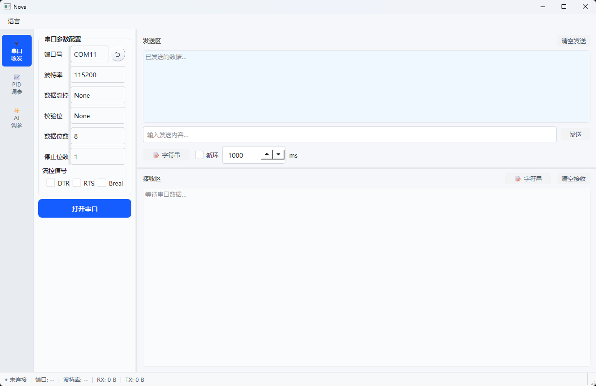
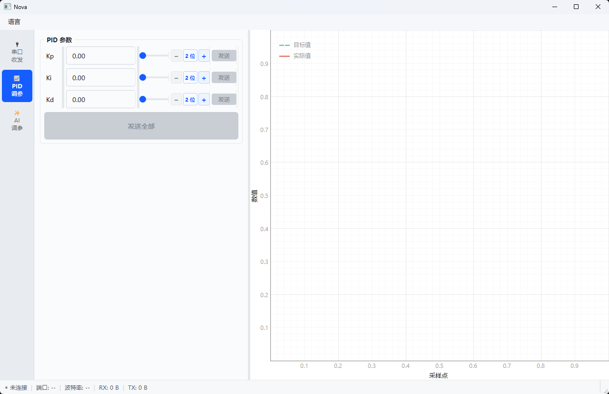
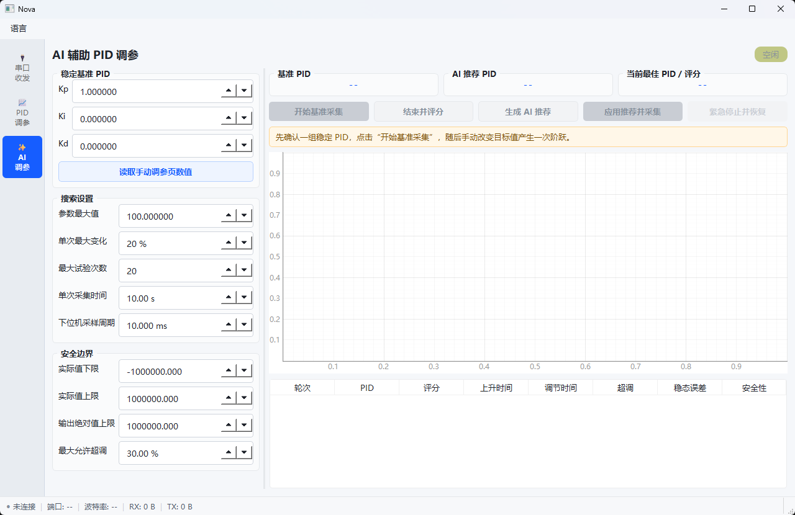

# Nova

面向嵌入式控制系统的串口调试与 PID 调参桌面工具，基于 PySide6、pyqtgraph、pyserial 和 NumPy 构建。

Nova 提供串口收发、实时波形、手动 PID 调参和本地贝叶斯优化。支持 Nova v2 协议的设备还可以执行带确认、保护和最终复测的自动调参流程。

本地调参不依赖网络或 API Key。可选云端解释仅提供文字分析，不参与参数搜索或设备控制。

## 目录

- [功能](#功能)
- [快速开始](#快速开始)
- [使用说明](#使用说明)
- [通信协议](#通信协议)
- [安全与限制](#安全与限制)
- [数据与隐私](#数据与隐私)
- [开发与测试](#开发与测试)
- [项目结构](#项目结构)
- [界面预览](#界面预览)
- [贡献](#贡献)

## 功能

| 模块 | 已实现能力 |
| --- | --- |
| 串口通信 | 端口扫描、串口参数及流控配置、文本与 HEX 收发、可选行结束符、循环发送、RX/TX 统计 |
| 手动调参 | Kp、Ki、Kd 独立设置 2–6 位小数，输入框与滑块联动，单参数或整组发送 |
| 波形分析 | 目标值、实际值与输出曲线，通道筛选、时间轴、暂停显示、双游标、CSV 导出 |
| 本地优化 | 高斯过程贝叶斯优化，阶跃响应评分，独立参数范围、分辨率、步长约束及参数锁定 |
| 自动试验 | 设备能力检查、命令确认、初始稳定判定、自动阶跃、逐轮确认或受限自动运行、最优复测 |
| 档案与记录 | P/PI/PID 设备档案、JSON 参数方案、会话自动保存、只读历史回放、HTML/CSV/JSON 导出 |
| 分析助手 | 离线规则解释、可选只读云端解释 |
| 界面 | 深色与浅色主题、中英文切换、设置记忆 |

## 快速开始

### 环境要求

- Python 3.11 或更高版本。
- 可运行 Qt 桌面应用的环境。当前回归验证在 Windows 上完成；Linux 和 macOS 尚未完成实机验证。
- 真实设备需要可用串口及相应驱动；使用内置模拟器不需要硬件。

### 安装与启动

```bash
git clone https://github.com/zwj051029/Nova.git
cd Nova
python -m venv venv
```

Windows PowerShell：

```powershell
.\venv\Scripts\python.exe -m pip install -r requirements.txt
.\venv\Scripts\python.exe main.py
```

Linux / macOS：

```bash
./venv/bin/python -m pip install -r requirements.txt
./venv/bin/python main.py
```

以上命令直接调用虚拟环境中的 Python，无需先激活环境。虚拟环境不可跨机器复制；如果已有 `venv` 引用了不存在的 Python 路径，请重新创建环境。

### 无硬件体验

1. 在“串口收发”页选择 `sim://`，点击打开串口。
2. 进入“AI 调参”页，点击“模拟预设 / Demo”。预设采样周期为 20 ms，基准 PID 为 `1, 0.5, 0`。
3. 选择“每轮确认”或“受限自动”，点击“自动试验 / Start”，阅读并确认提示。
4. 查看各轮评分与曲线，等待最优参数复测完成。
5. 选择接受最优参数或恢复原参数。两种操作都会保持模拟设备输出停止。

`sim://` 是应用内置的模拟串口名称，不是网页地址，也不需要安装虚拟串口驱动。模拟器执行 PID 闭环计算，包含一阶惯性、输出饱和和积分抗饱和；仿真结果不代表真实设备性能。

## 使用说明

### 串口与手动 PID

连接设备后，先在串口页确认数据正常，再进入“PID 调参”页选择对应通道。

- Kp、Ki、Kd 的小数位数通过各自的 `+` / `−` 按钮调整，范围为 2–6 位，互不影响。
- 手动编辑小数时，位数显示随输入更新。减少精度会对当前值舍入；发送使用各参数当前的显示精度。
- 波形保留最近 500 个采样点。暂停只冻结显示，不停止串口接收；CSV 导出当前显示的数据。
- AI 试验占用设备控制权期间，其他页面不能发送指令或修改串口控制信号。

### 本地优化如何工作

实际生成 PID 候选的是本地高斯过程贝叶斯优化器，而不是大语言模型。优化器使用历史试验的参数与评分建立模型，并在配置的范围、变化限制及锁定条件内推荐下一组参数。

评分依据包括 IAE、超调、调节时间、稳态误差及输出变化；同时报告上升时间、ITAE 等指标。综合评分越低越好，但不构成闭环稳定性或全局最优保证。无有效阶跃、采样不足或目标持续变化的记录不会作为有效优化样本。

### 人工采集模式

适用于仅实现旧版文本协议的设备。

1. 准备一组已经在实际设备上验证稳定的 PID，填入或从手动调参页读取。
2. 配置真实采样周期、采集时长、参数范围和安全阈值。
3. 点击“开始基准采集”，随后在设备端改变一次目标值，并保持目标不变。
4. 结束采集并评分，生成推荐后审核参数。
5. 点击“应用推荐并采集”，使用相同条件重复阶跃试验。

旧版协议没有执行确认。异常时软件尝试恢复基准参数，但无法确认设备是否收到或生效，也不能保证设备停止。

### 自动试验模式

需要固件实现 [Nova v2 协议](#nova-v2-协议)。开始前，应在“设备档案与独立范围 / Profile”中填写设备名称、单位、通道、控制模式、真实周期、目标阶跃和保护条件。

流程依次为：能力检查、读取原参数、配置设备保护、停止输出、确认 PID、等待初始稳定、采集阶跃前数据、确认阶跃、采集评分、迭代、最优复测、停止并等待用户决定。

- **每轮确认**：每轮结束停止输出，由用户确认后开始下一轮。
- **受限自动**：在最大轮数、无改善轮数、目标评分与安全条件限制下自动迭代。
- **最优复测**：预留一轮验证最佳候选；复测评分不得高于候选评分的 `1.1 倍 + 0.5`。
- **接受或恢复**：确认参数写入设备 RAM，输出保持停止；不写入 Flash，不自动恢复运动。

自动试验至少需要 3 轮。尚未在采集窗口内确认响应稳定的情况会单独提示；通过重复性复测不等于证明系统稳定。

## 通信协议

### 旧版文本协议

使用 UTF-8 编码，按换行分帧。以下 `\r\n` 表示实际的回车换行字节。

下位机遥测：

```text
>ID,Setpoint,Actual,Output\r\n
>1,1500.500000,1498.300000,0.650000\r\n
```

`ID` 为非负整数通道号，其余字段分别为目标值、实际值和控制输出，必须是有限数值。旧版遥测没有设备时间戳，人工采集按配置的采样周期重建时间轴。

整组和单参数下发：

```text
PID:1.250000,0.050000,0.001000\r\n
PID:Kp=1.250000\r\n
PID:Ki=0.050000\r\n
PID:Kd=0.001000\r\n
```

固件需要实现整组和单参数两种解析方式，才能使用所有手动发送按钮。手动页各参数发送精度为 2–6 位，以上仅为六位小数示例。

### Nova v2 协议

格式为 `@` 前缀、单行 JSON 和 `\n`。数值必须有限，PID 传输分辨率为 `0.000001`。命令与 ACK 按 `id` 和 `cmd` 匹配，固件应在实际执行后返回 `ok:true`；上位机确认超时为 1.5 秒。

```text
@{"type":"command","id":"session-1","cmd":"hello","channel":1}
@{"type":"ack","id":"session-1","cmd":"hello","ok":true,"version":2,"capabilities":["ack","set_pid","set_target","stop","watchdog","timestamp","limits"],"algorithm":"positional_pid_d_on_measurement","period":0.02}
@{"type":"telemetry","channel":1,"seq":123,"time":2.46,"sp":1.0,"pv":0.92,"out":1.04}
```

`time` 是递增的设备采样时间，单位为秒；同一通道的 `seq` 逐帧加一。严格模式遇到丢帧、乱序或时间回退即中止，不插值掩盖数据缺失。固件须按序处理命令，避免重复执行相同 ID 的请求。

| 命令 | 请求字段 | ACK 字段或执行约定 |
| --- | --- | --- |
| `hello` | 无 | 返回 `version`、`capabilities`、`algorithm`、`period` |
| `get` | 无 | 返回 `gains:[kp,ki,kd]`、`target`、`enabled` |
| `configure` | `actual_min`、`actual_max`、`output_limit`、`watchdog` | 在设备端应用保护；`watchdog` 单位为秒 |
| `set_pid` | `gains:[kp,ki,kd]` | 返回实际生效的 `gains`；试验要求重置积分状态 |
| `set_target` | `value` | 返回实际生效的 `value`，启用控制；故障锁存时拒绝 |
| `stop` | 无 | 关闭输出并清除积分，执行后返回 ACK |
| `heartbeat` | 无 | 刷新设备看门狗；上位机约每 200 ms 发送，忽略其 ACK |

设备故障帧：

```text
@{"type":"fault","channel":1,"reason":"overtemperature"}
```

当前自动模式对应位置式并联 PID、微分作用于测量值，`Ki` 按秒积分、`Kd` 按秒微分。固件算法或周期不匹配时拒绝启动；其他 PID 形式需要先适配，不能直接复用同一组参数。

解析器与模拟设备参考实现见 [tuning/protocol.py](tuning/protocol.py) 和 [tuning/device.py](tuning/device.py)。

## 安全与限制

上位机检查不能替代设备端保护。默认档案是通用占位配置，不可直接作为真实设备的安全配置。

- 固件必须独立实现输出限幅、积分抗饱和、必要的超温/超速保护、通信看门狗及急停。
- 参数范围、单次变化量、实际值边界、输出上限和超调阈值必须按设备能力配置。首次试验使用保守参数和小阶跃。
- 自动模式遇到命令拒绝或超时、遥测异常、外部目标变更、越界、持续饱和或频繁振荡时请求停止。
- 停止只有收到对应 ACK 后才视为确认完成。通信中断或停止未确认时，依赖固件看门狗停止输出。
- 仿真与软件回归测试不覆盖真实设备的全部延迟、噪声、执行机构限制和故障情形，接入后仍需实机验收。

## 数据与隐私

- 调参会话默认保存在 Qt 的应用数据目录下的 `tuning_sessions/`，也可通过 `NOVA_DATA_DIR` 指定保存根目录。
- 会话包含配置、PID、指标、原始采样和自动试验状态记录，使用版本化 JSON 与原子写入。
- 参数方案加载只更新界面，不下发设备指令。打开历史会话为只读回放，可选择试验行并导出报告。
- 本地规则解释无需网络。可选云端解释当前仅接入 OpenAI，未实现 DeepSeek 接口。
- 云端解释需提供可用的模型 ID 和 API Key，并明确确认上传。发送内容为可预览的参数、配置及指标摘要，不包含原始波形或串口日志；密钥不由应用写入磁盘。
- 云端请求设置 `store=false`，但这不等同于零数据保留。调用可能产生费用；云端功能不可用不影响本地调参。

## 开发与测试

### 回归测试

Windows：

```powershell
.\venv\Scripts\python.exe -B -X utf8 -m unittest discover -s tests -v
```

测试覆盖串口分帧与回环、UTF-8/HEX 收发、PID 输入和实际发送精度、主题切换、波形导出、阶跃评分、安全约束、优化候选、自动试验、异常停止、档案持久化及只读回放。云端接口采用模拟响应测试，不使用真实密钥。

### 界面集成测试

```powershell
.\venv\Scripts\python.exe -B -X utf8 tests/gui_smoke.py
```

该测试使用 Qt 事件循环和 `sim://` 后台串口，验证完整自动调参、最优复测、参数接受及试验中断开连接。运行约一分钟，默认离屏执行；截图与报告保存在被 Git 忽略的 `.test-artifacts/` 中。

Linux / macOS 可将上述 Python 路径替换为 `./venv/bin/python`。当前不提供这些平台已通过验证的承诺。

### 虚拟串口发送器

`virtual_serial_sender.py` 可连接已有的虚拟串口对，用于验证旧版遥测收发与波形显示：

```powershell
.\venv\Scripts\python.exe virtual_serial_sender.py COM20
```

随后让 Nova 连接配对端口，例如 `COM21`，波特率为 `115200`。该发送器输出连续变化的数据，不适合作为自动阶跃调参试验源；完整流程请使用 `sim://`。

## 项目结构

```text
Nova/
├── main.py                  # 应用入口、导航与数据路由
├── serial_page.py           # 串口收发界面
├── serial_worker.py         # 后台串口读写与分帧
├── pid_page.py              # 手动 PID 与实时波形
├── ai_tuning_page.py        # 调参工作区与交互
├── theme.py                 # 深浅主题
├── i18n.py                  # 中英文翻译
├── virtual_serial_sender.py # 旧版遥测发送器
├── tuning/
│   ├── models.py            # 数据模型与配置校验
│   ├── metrics.py           # 阶跃识别与性能评分
│   ├── safety.py            # 安全约束
│   ├── optimizer.py         # 高斯过程贝叶斯优化
│   ├── session.py           # 采集会话
│   ├── automatic.py         # 自动试验状态机
│   ├── protocol.py          # 协议编解码
│   ├── simulator.py         # 一阶对象仿真
│   ├── device.py            # 模拟设备与故障注入
│   ├── config_dialog.py     # 设备档案编辑
│   ├── storage.py           # JSON 持久化
│   ├── reporting.py         # 报告与本地解释
│   └── cloud_advisor.py     # 可选只读云端解释
├── tests/                   # 回归与界面集成测试
├── images/                  # 界面截图
└── requirements.txt         # 运行依赖
```

## 界面预览

以下截图用于展示页面布局，具体控件以当前版本为准。

<details>
<summary>串口收发</summary>



</details>

<details>
<summary>手动 PID 调参</summary>



</details>

<details>
<summary>AI 辅助调参</summary>



</details>

## 贡献

提交问题时，请提供操作系统、Python 版本、复现步骤、预期与实际行为，以及脱敏后的日志或协议帧。请勿提交 API Key、设备凭据或敏感采样数据。

提交修改前运行回归测试；涉及界面、串口或自动调参流程的变更，请同时运行界面集成测试。修复缺陷时应附带能够复现问题的测试。
